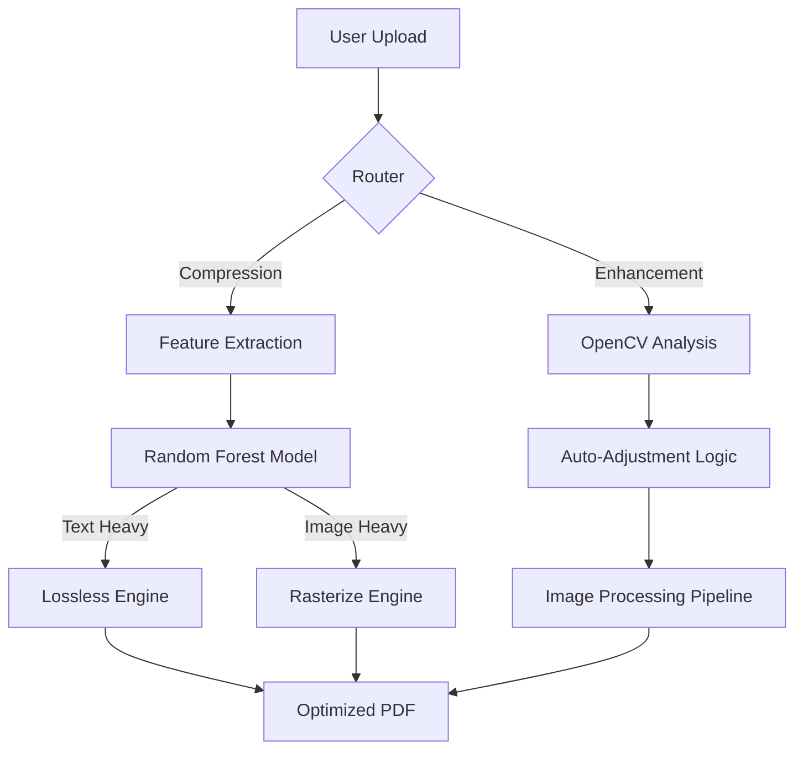

# DocuMind AI 🧠
### Intelligent Document Processing & Optimization Suite

[](https://www.python.org/)
[](https://streamlit.io/)
[](https://scikit-learn.org/)
[](https://opencv.org/)

**DocuMind AI** is a comprehensive solution for automated document management, leveraging Machine Learning and Computer Vision to intelligently compress and enhance PDF documents.

---

## 🚀 Key Features

### 1. 📉 Smart Compression Engine
*   **Problem:** Standard compression ruins text quality or fails to reduce file size on vector PDFs.
*   **Solution:** Uses a **Random Forest Classifier** to analyze document structure (Text/Image Ratio, Vector Count).
*   **Outcome:** Automatically selects **Lossless Optimization** for text docs and **Rasterization** for scans, achieving up to **70% size reduction** without quality loss.
*   **Active Learning:** The model retrains itself in real-time based on user feedback.

### 2. ✨ CV-Powered Enhancement
*   **Problem:** Scanned documents are often dark, blurry, or low-contrast.
*   **Solution:** Uses **OpenCV** to calculate pixel intensity histograms and Laplacian variance (blur detection).
*   **Outcome:** Auto-adjusts Brightness, Contrast, and Sharpness to restore document clarity.

---

## 🏗 System Architecture



## 🛠️ Tech Stack

*   **Frontend:** Streamlit
*   **PDF Core:** PyMuPDF (Fitz)
*   **Machine Learning:** Scikit-Learn (Random Forest)
*   **Computer Vision:** OpenCV, PIL
*   **Visualization:** Plotly

## 📦 Installation

1.  **Clone the repository:**
    ```bash
    git clone https://github.com/bravo2024/DocuMind-AI.git
    cd DocuMind-AI
    ```

2.  **Install Dependencies:**
    ```bash
    pip install -r requirements.txt
    ```

3.  **Run the Application:**
    ```bash
    streamlit run app.py
    ```

## 👨‍💻 Developer Notes

This project demonstrates the application of **applied AI** to solve real-world administrative bottlenecks. The modular design allows for easy extension into OCR and extraction tasks.

---
*Developed by Vivek.*
